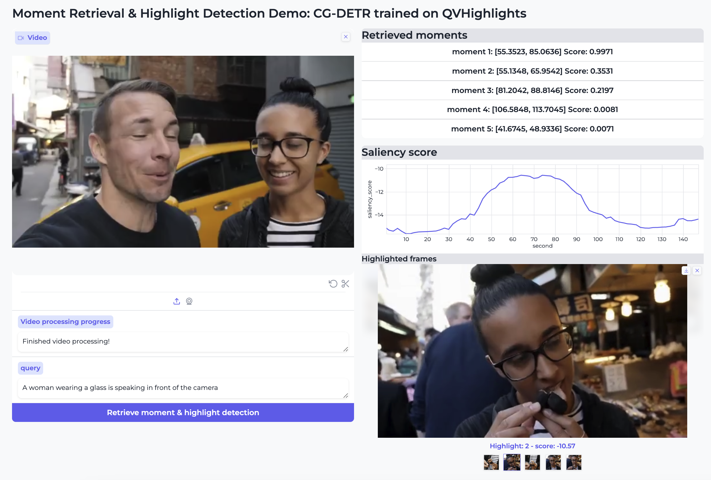

# Lighthouse


[](https://opensource.org/licenses/Apache-2.0)
[](https://huggingface.co/spaces/awkrail/lighthouse_demo)
[](https://github.com/line/lighthouse/actions/workflows/pytest.yml)
[](https://github.com/line/lighthouse/actions/workflows/mypy_ruff.yml)

Lighthouse is a user-friendly library for reproducible video moment retrieval and highlight detection (MR-HD).
It supports seven models, four features (video and audio features), and six datasets for reproducible MR-HD, MR, and HD. In addition, we prepare an inference API and Gradio demo for developers to use state-of-the-art MR-HD approaches easily.
Furthermore, Lighthouse supports [audio moment retrieval](https://h-munakata.github.io/Language-based-Audio-Moment-Retrieval/), a task to identify relevant moments from an audio input based on a given text query.

## News
- [2024/10/22] [Version 1.0](https://github.com/line/lighthouse/releases/tag/v1.0) has been released.
- [2024/10/6] Our paper has been accepted at EMNLP2024, system demonstration track.
- [2024/09/25] Our work ["Language-based audio moment retrieval"](https://arxiv.org/abs/2409.15672) has been released. Lighthouse supports AMR.
- [2024/08/22] Our demo paper is available on arXiv. Any comments are welcome: [Lighthouse: A User-Friendly Library for Reproducible Video Moment Retrieval and Highlight Detection](https://www.arxiv.org/abs/2408.02901).

## Installation
Install ffmpeg first. If you are an Ubuntu user, run:
```
apt install ffmpeg
```
Then, install pytorch, torchvision, torchaudio, and torchtext based on your GPU environments.
Note that the inference API is available for CPU environments. We tested the codes on Python 3.9 and CUDA 11.8:
```
pip install torch==2.1.0 torchvision==0.16.0 torchaudio==2.1.0 torchtext==0.16.0 --index-url https://download.pytorch.org/whl/cu118
```
Finally, run to install dependency libraries:
```
pip install 'git+https://github.com/line/lighthouse.git'
```

## Inference API (Available for both CPU/GPU mode)
Lighthouse supports the following inference API:
```python
import torch
from lighthouse.models import CGDETRPredictor

# use GPU if available
device = "cuda" if torch.cuda.is_available() else "cpu"

# slowfast_path is necesary if you use clip_slowfast features
query = 'A man is speaking in front of the camera'
model = CGDETRPredictor('results/cg_detr/qvhighlight/clip_slowfast/best.ckpt', device=device,
                        feature_name='clip_slowfast', slowfast_path='SLOWFAST_8x8_R50.pkl')

# encode video features
model.encode_video('api_example/RoripwjYFp8_60.0_210.0.mp4')

# moment retrieval & highlight detection
prediction = model.predict(query)
print(prediction)
"""
pred_relevant_windows: [[start, end, score], ...,]
pred_saliency_scores: [score, ...]

{'query': 'A man is speaking in front of the camera',
 'pred_relevant_windows': [[117.1296, 149.4698, 0.9993],
                           [-0.1683, 5.4323, 0.9631],
                           [13.3151, 23.42, 0.8129],
                           ...],
 'pred_saliency_scores': [-10.868017196655273,
                          -12.097496032714844,
                          -12.483806610107422,
                          ...]}
"""
```
Run `python api_example/demo.py` to reproduce the results. It automatically downloads pre-trained weights for CG-DETR (CLIP backbone).
If you want to use other models, download [pre-trained weights](https://drive.google.com/file/d/1jxs_bvwttXTF9Lk3aKLohkqfYOonLyrO/view?usp=sharing). 
When using `clip_slowfast` features, it is necessary to download [slowfast pre-trained weights](https://dl.fbaipublicfiles.com/pyslowfast/model_zoo/kinetics400/SLOWFAST_8x8_R50.pkl).
When using `clip_slowfast_pann` features, in addition to the slowfast weight, download [panns weights](https://zenodo.org/record/3987831/files/Cnn14_mAP%3D0.431.pth).
Run `python api_example/amr_demo.py` to reproduce the AMR results.

**Limitation**: The maximum video duration is **150s** due to the current benchmark datasets.
For CPU users, set `feature_name='clip'` because CLIP+Slowfast or CLIP+Slowfast+PANNs features are very slow without GPUs.

## Gradio demo
Run `python gradio_demo/demo.py`. Upload the video and input text query, and click the blue button. For AMR demo, run `python gradio_demo/amr_demo.py`.



## Supported models, datasets, and features
### Models
Moment retrieval & highlight detection
- [x] : [Moment-DETR (Lei et al. NeurIPS21)](https://arxiv.org/abs/2107.09609)
- [x] : [QD-DETR (Moon et al. CVPR23)](https://arxiv.org/abs/2303.13874)
- [x] : [EaTR (Jang et al. ICCV23)](https://arxiv.org/abs/2308.06947)
- [x] : [CG-DETR (Moon et al. arXiv24)](https://arxiv.org/abs/2311.08835)
- [x] : [UVCOM (Xiao et al. CVPR24)](https://arxiv.org/abs/2311.16464)
- [x] : [TR-DETR (Sun et al. AAAI24)](https://arxiv.org/abs/2401.02309)
- [x] : [TaskWeave (Jin et al. CVPR24)](https://arxiv.org/abs/2404.09263)

### Datasets
Moment retrieval & highlight detection
- [x] : [QVHighlights (Lei et al. NeurIPS21)](https://arxiv.org/abs/2107.09609)
- [x] : [QVHighlights w/ Audio Features (Lei et al. NeurIPS21)](https://arxiv.org/abs/2107.09609)
- [x] : [QVHighlights ASR Pretraining (Lei et al. NeurIPS21)](https://arxiv.org/abs/2107.09609)

Moment retrieval
- [x] : [ActivityNet Captions (Krishna et al. ICCV17)](https://arxiv.org/abs/1705.00754)
- [x] : [Charades-STA (Gao et al. ICCV17)](https://arxiv.org/abs/1705.02101)
- [x] : [TaCoS (Regneri et al. TACL13)](https://aclanthology.org/Q13-1003/)

Highlight detection
- [x] : [TVSum (Song et al. CVPR15)](https://www.cv-foundation.org/openaccess/content_cvpr_2015/papers/Song_TVSum_Summarizing_Web_2015_CVPR_paper.pdf)
- [x] : [YouTube Highlights (Sun et al. ECCV14)](https://grail.cs.washington.edu/wp-content/uploads/2015/08/sun2014rdh.pdf)

Audio moment retrieval
- [x] : [Clotho Moment/TUT2017/UnAV100-subset (Munakata et al. arXiv24)](https://h-munakata.github.io/Language-based-Audio-Moment-Retrieval/)

### Features
- [x] : ResNet+GloVe
- [x] : CLIP
- [x] : CLIP+Slowfast
- [x] : CLIP+Slowfast+PANNs (Audio) for QVHighlights
- [x] : I3D+CLIP (Text) for TVSum

## Reproduce the experiments

### Pre-trained weights
Pre-trained weights can be downloaded from [here](https://drive.google.com/file/d/1jxs_bvwttXTF9Lk3aKLohkqfYOonLyrO/view?usp=sharing).
Download and unzip on the home directory.

### Datasets
Due to the copyright issue, we here distribute only feature files.
Download and place them under `./features` directory.
To extract features from videos, we use [HERO_Video_Feature_Extractor](https://github.com/linjieli222/HERO_Video_Feature_Extractor).

- [QVHighlights](https://drive.google.com/file/d/1-ALnsXkA4csKh71sRndMwybxEDqa-dM4/view?usp=sharing)
- [Charades-STA](https://drive.google.com/file/d/1EOeP2A4IMYdotbTlTqDbv5VdvEAgQJl8/view?usp=sharing)
- [ActivityNet Captions](https://drive.google.com/file/d/1P2xS998XfbN5nSDeJLBF1m9AaVhipBva/view?usp=sharing)
- [TACoS](https://drive.google.com/file/d/1rYzme9JNAk3niH1K81wgT13pOMn005jb/view?usp=sharing)
- [TVSum](https://drive.google.com/file/d/1gSex1hpXLxHQu6zHyyQISKZjP7Ndt6U9/view?usp=sharing)
- [YouTube Highlight](https://drive.google.com/file/d/12swoymGwuN5TlDlWBTo6UUWVm2DqVBpn/view?usp=sharing)

For [AMR](https://h-munakata.github.io/Language-based-Audio-Moment-Retrieval/), download features from here.

- [Clotho Moment/TUT2017/UnAV100-subset](https://zenodo.org/records/13806234)

The whole directory should be look like this:
```
lighthouse/
├── api_example
├── configs
├── data
├── features # Download the features and place them here
│   ├── ActivityNet
│   │   ├── clip
│   │   ├── clip_text
│   │   ├── resnet
│   │   └── slowfast
│   ├── Charades
│   │   ├── clip
│   │   ├── clip_text
│   │   ├── resnet
│   │   ├── slowfast
│   ├── QVHighlight
│   │   ├── clip
│   │   ├── clip_text
│   │   ├── pann
│   │   ├── resnet
│   │   └── slowfast
│   ├── tacos
│   │   ├── clip
│   │   ├── clip_text
│   │   ├── resnet
│   │   └── slowfast
│   ├── tvsum
│   │   ├── clip
│   │   ├── clip_text
│   │   ├── i3d
│   │   ├── resnet
│   │   ├── slowfast
│   ├── youtube_highlight
│   │   ├── clip
│   │   ├── clip_text
│   │   └── slowfast
│   └── clotho-moments
│       ├── clap
│       └── clap_text
├── gradio_demo
├── images
├── lighthouse
├── results # The pre-trained weights are saved in this directory
└── training
```

### Training and evaluation

#### Training
The training command is:
```
python training/train.py --model MODEL --dataset DATASET --feature FEATURE [--resume RESUME] [--domain DOMAIN]
```
|         | Options                                                                                                  |
|---------|----------------------------------------------------------------------------------------------------------|
| Model   | moment_detr, qd_detr, eatr, cg_detr, uvcom, tr_detr, taskweave_mr2hd, taskweave_hd2mr                    |
| Feature | resnet_glove, clip, clip_slowfast, clip_slowfast_pann, i3d_clip, clap                                    |
| Dataset | qvhighlight, qvhighlight_pretrain, activitynet, charades, tacos, tvsum, youtube_highlight, clotho-moment |

(**Example 1**) Moment DETR w/ CLIP+Slowfast on QVHighlights:
```
python training/train.py --model moment_detr --dataset qvhighlight --feature clip_slowfast
```
(**Example 2**) Moment DETR w/ CLIP+Slowfast+PANNs (Audio) on QVHighlights:
```
python training/train.py --model moment_detr --dataset qvhighlight --feature clip_slowfast_pann
```
(**Pre-train & Fine-tuning, QVHighlights only**) Lighthouse supports pre-training. Run:
```
python training/train.py --model moment_detr --dataset qvhighlight_pretrain --feature clip_slowfast
```
Then fine-tune the model with `--resume` option:
```
python training/train.py --model moment_detr --dataset qvhighlight --feature clip_slowfast --resume results/moment_detr/qvhighlight_pretrain/clip_slowfast/best.ckpt
```
(**TVSum and YouTube Highlight**) To train models on these two datasets, you need to specify domain:
```
python training/train.py --model moment_detr --dataset tvsum --feature clip_slowfast --domain BK
```

#### Evaluation
The evaluation command is:
```
python training/evaluate.py --model MODEL --dataset DATASET --feature FEATURE --split {val,test} --model_path MODEL_PATH --eval_path EVAL_PATH [--domain DOMAIN]
```
(**Example 1**) Evaluating Moment DETR w/ CLIP+Slowfast on the QVHighlights val set:
```
python training/evaluate.py --model moment_detr --dataset qvhighlight --feature clip_slowfast --split val --model_path results/moment_detr/qvhighlight/clip_slowfast/best.ckpt --eval_path data/qvhighlight/highlight_val_release.jsonl
```
To generate submission files for QVHighlight test sets, change split into test (**QVHighlights only**):
```
python training/evaluate.py --model moment_detr --dataset qvhighlight --feature clip_slowfast --split test --model_path results/moment_detr/qvhighlight/clip_slowfast/best.ckpt --eval_path data/qvhighlight/highlight_test_release.jsonl
```
Then zip `hl_val_submission.jsonl` and `hl_test_submission.jsonl`, and submit it to the [Codalab](https://codalab.lisn.upsaclay.fr/competitions/6937) (**QVHighlights only**):
```
zip -r submission.zip val_submission.jsonl test_submission.jsonl
```

## Citation
```bibtex
@InProceedings{taichi2024emnlp,
  author    = {Taichi Nishimura and Shota Nakada and Hokuto Munakata and Tatsuya Komatsu},
  title     = {Lighthouse: A User-Friendly Library for Reproducible Video Moment Retrieval and Highlight Detection},
  booktitle = {Proceedings of The 2024 Conference on Empirical Methods in Natural Language Processing: System Demonstrations},
  year      = {2024},
}
```

## Contributing
Pull requests are welcome. For major changes, please open an issue first to discuss what you would like to change.

## LICENSE
Apache License 2.0

## Contact
Taichi Nishimura ([taichitary@gmail.com](taichitary@gmail.com))
